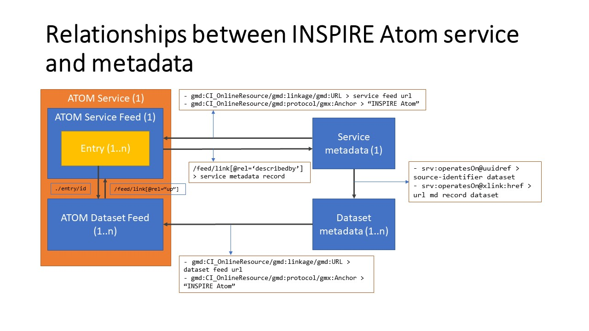

# ngr-atom-test

This repository contains an example implementation of an INSPIRE Atom download service and the associated metadata, to test the OpenSearch implementation on NGR. This repo contains:

- [ATOM service feed](https://pdok.github.io/ngr-atom-test/index.xml)
- [ATOM dataset feed](https://pdok.github.io/ngr-atom-test/hydrografie.xml)
- [service metadata](https://ngr.acceptatie.nationaalgeoregister.nl/geonetwork/srv/dut/csw?service=CSW&version=2.0.2&request=GetRecordById&outputschema=http://www.isotc211.org/2005/gmd&elementsetname=full&id=628a60c8-76a4-483f-ad2b-2e6d32f53cd2) (also available in [repo](metadata/628a60c8-76a4-483f-ad2b-2e6d32f53cd2.xml) in case metadata in catalog changes)
- [dataset metadata](https://ngr.acceptatie.nationaalgeoregister.nl/geonetwork/srv/dut/csw?service=CSW&version=2.0.2&request=GetRecordById&outputschema=http://www.isotc211.org/2005/gmd&elementsetname=full&id=628a60c8-76a4-483f-ad2b-2e6d32f53cd2) (also available in [repo](metadata/628a60c8-76a4-483f-ad2b-2e6d32f53cd2.xml) in case metadata in catalog changes)

This implementation uses the [NGR acceptatie environment](https://ngr.acceptatie.nationaalgeoregister.nl/geonetwork).

## Requirements ATOM service harvesting 

For a INSPIRE Atom service to be correctly harvested by NGR it needs to meet 3 requirements:

- service metadata points to service feed URL with protocol "INSPIRE Atom"
- service metadata operatesOn@uuidref points to innertext of the identifier element of the dataset metadata record
- the dataset points to the dataset atomfeed url with protocol "INSPIRE Atom"

## Atom Harvesting NGR

In order for NGR to populate the opensearch service with ATOM service it needs to harvest/index the ATOM service records. This is a process that is run periodically each night on the NGR production and acceptance instances. Initation of the ATOM harvesting/indexing can also be triggered from the NGR admin interface. Go to "Admin" > "Instellingen" and search for "atom".

## Open Search URLS

OpenSearchDescription:
- https://ngr.acceptatie.nationaalgeoregister.nl/geonetwork/opensearch/dut/15c3c30f-0db2-4b3b-80f6-b990c8fc8225/OpenSearchDescription.xml

### Parametrized OpenSearch URLS

With the paramaters from the `Query` element in the [OpenSearchDescription](https://ngr-2020-acc.geocat.live/geonetwork/opensearch/dut/15c3c30f-0db2-4b3b-80f6-b990c8fc8225/OpenSearchDescription.xml) the OpenSearch search and download request will be parametrized like this (which will result in HTTP 500 response atm):

search: 
- https://ngr.acceptatie.nationaalgeoregister.nl/geonetwork/opensearch/dut/describe?spatial_dataset_identifier_code=966ff24d-1eb2-48b2-9780-d549a46dfd6b&spatial_dataset_identifier_namespace=https://www.hetwaterschapshuis.nl&language=nl

download:
- https://ngr.acceptatie.nationaalgeoregister.nl/geonetwork/opensearch/dut/download?spatial_dataset_identifier_code=966ff24d-1eb2-48b2-9780-d549a46dfd6b&spatial_dataset_identifier_namespace=https://www.hetwaterschapshuis.nl&language=nl&crs=http://www.opengis.net/def/crs/EPSG/0/4258
